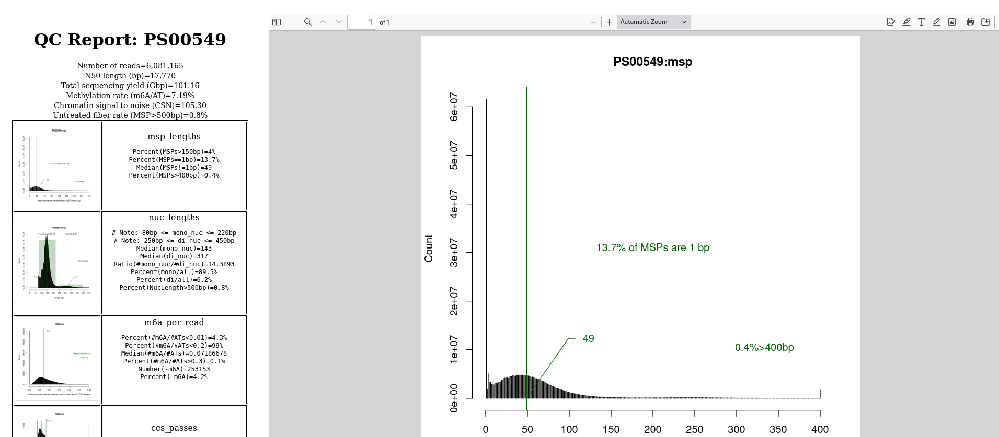

# fiberseq-qc
QC plots and statistics

<h4>Software Setup</h4>
# download the software: 
<code>git clone https://github.com/fiberseq/fiberseq-qc.git</code>  
# install external dependencies using: 
<code>conda create -n fiberseq-qc</code> 
<code>mamba env update -n fiberseq-qc --file env/qc.yaml</code>  
Then, activate your environment 
<code>conda activate fiberseq-qc</code>

<h4>Example Run</h4>
<code>src/runall-qc.tcsh my-output-dir PS00246 fiberseq.bam fiberseq.all.tbl.gz</code>
  where fiberseq.bam and fiberseq.all.tbl.gz were produced using the fiberseq-smk or fibertools-rs pipeline 

<h4>Output</h4>
The main output is a page that ends in overview.html that you can open in your browser. 
On the left side is a series of pertinent histogram and other analysis images with statistics. 
On the right side is a blow-up of any image that you mouse over on the left. 
  

