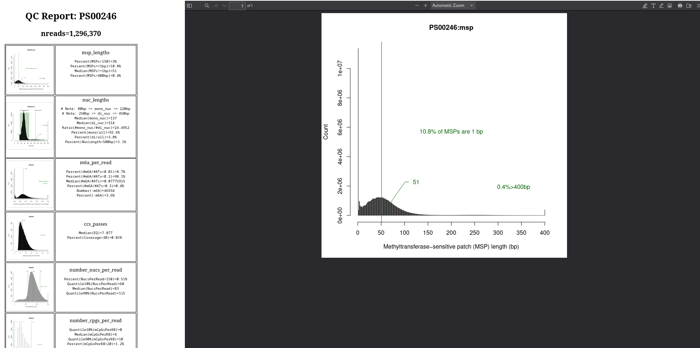

# fiberseq-qc
QC plots and statistics

<h4>Software Setup</h4>
# download the software: 
<code>git clone https://github.com/fiberseq/fiberseq-qc.git</code> 
<code>cd fiberseq-qc</code>  
# install external dependencies using: 
<code>conda create -n fiberseq-qc</code> 
<code>mamba env update -n fiberseq-qc --file env/qc.yaml</code>  
Then, activate your environment 
<code>conda activate fiberseq-qc</code>

<h4>Example Run</h4>
<code>src/runall-qc.tcsh my-output-dir my-sample-name fiberseq.ft.bam</code>
  where fiberseq.ft.bam was produced using the <code>ft predict-m6a</code> or <code>ft add-nucleosome</code> command 

<h4>Output</h4>
The main output is a page that ends in overview.html that you can open in your browser. 
On the left side is a series of pertinent histogram and other analysis images with statistics. 
On the right side is a blow-up of any image that you mouse over on the left. 
  

  

<h4>Stats</h4>
You can look at your sample's statistics relative to the distribution of all of our lab's human samples' <a href="https://s3.kopah.uw.edu/prod-reporter/index.html">statistics</a>. 
When loaded, you will be under the 'QC Reports' menu.  Near the top, click on the 'Meta' tab, and then press the 'Upload-QC' button. 
Upload the file that ends with qc_stats.txt.  Your sample's values are shown in red. 
  

  

Some salient statistics appear at the top of your sample's QC output, which may look like: 
Number of reads=6,081,165 
N50 length (bp)=17,770 
Total sequencing yield (Gbp)=101.16 
Methylation rate (m6A/AT)=7.19% 
Chromatin signal to noise (CSN)=105.30 
Untreated fiber rate (MSP>500bp)=0.8% 
 
In addition to the Number of reads, the final 3 shown are important. 
The Methylation rate shows the proportion of A/T's that were methylated. 
The Untreated fiber rate is related and shows the proportion of fibers with very little methylation (a high value indicates undermethylation). 
The Chromatin signal to noise (CSN) uses autocorrelation and is a metric related to the Nuclei extract step.  You want CSN>10. 
 
Additionally, we like to look closely at the 2 autocorrelation plots and the 2 randfibers plots.  Here are plots from a successful sample. 
  

  

  
The randfibers plots show a bird's eye view of sampled fibers.  The plots are from 0-20 kb and (zoomed in) 2-4 kb. 
The autocorrelation for a successful sample shows a signature curve profile, often crossing at y=0. 
When it does, it often marks the typical size of a nucleosome. 
The second autocorrelation plot is the same but extends out to a lag of 2kb.  We use to this to derive the 
Chromatin signal to noise (CSN) metric. 
